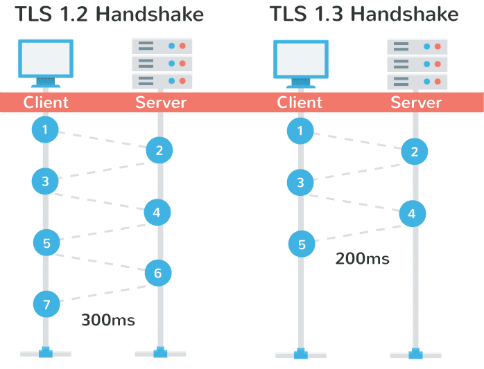
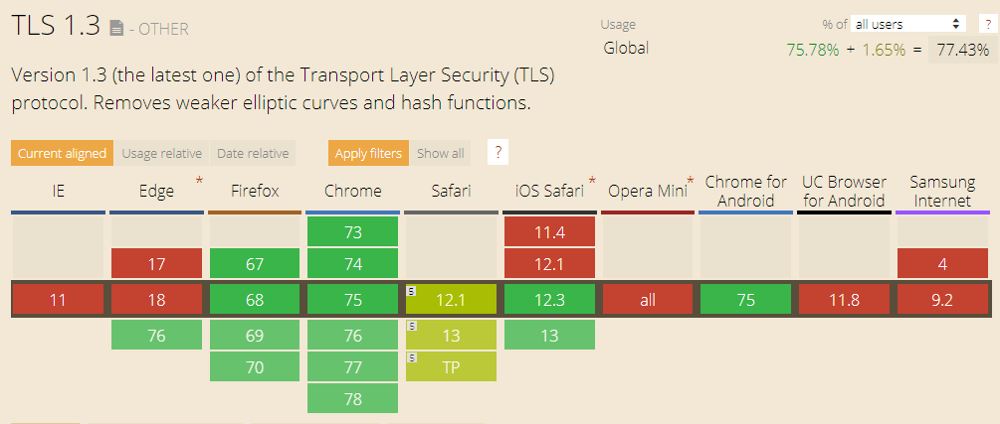

## SSL(Secure Socket Layer) / TLS(Transport Layer Security)
* TLS 는 SSL 의 후속 프로토콜로써 대개 SSL 또는 SSL/TLS 라는 이름으로 주로 사용된다.
* 전송계층 상에서 클라이언트, 서버에 대한 인증 및 데이터 암호화를 수행한다.
* 주로 웹 서버와 브라우저 사이의 안전한 보안 채널을 제공하기 위해 많이 사용된다.
 

### 역사
* 넷스케이프사에서 최초로 제안
    * SSL 1.0 (1994.7) - deprecated
    * SSL 2.0 (1994.12) - deprecated
    * SSL 3.0 (1996.11) - deprecated
* IETF 에 의해 TLS 1.0 으로 표준화
    * TLS 1.0 (RFC 2246,1999) - not recommended
    * TLS 1.1 (RFC 4346, 2006) - not recommended
    * TLS 1.2 (RFC 5246, 2008)
    * TLS 1.3 (RFC 8446, 2018)
* TLS 1.0, TLS 1.1 는 모든 주요 브라우저에서 2020년에 지원을 중단 할 예정
* TLS 1.2 는 MITM, POODLE, SLOTH, DROWN 공격에 취약
* TLS 1.3 은 속도, 보안, 암호화 관리방법을 개선하여 많은 취약점을 해결

## TLS 1.3
### 속도의 향상
TLS 1.2 에서는 TLS 핸드셰이크를 완료하는데 2 RTT 가 소요되었다. 
TLS 1.3 에서는 처음 1 RTT 가 소요되고 이후 0 RTT 가 소요된다.

---
### 보안 향상
* Cipher Suite 가 조합하는 형태로 변경되어 확장에 유연
* 기존과의 호환성을 위해 지원했지만 오래되어 보안에 위협이 되는 레거시 기능을 삭제
* 기존에 암호화 기법과 무결성 체크 기법 분리로 발생하는 구현의 실수를 방지하고 사용하기 쉽게 개선 

#### TLS 1.0 - 1.2 Cipher Suite
`TLS_[키 교환 알고리즘]_[인증 알고리즘]_WITH_[암호화 알고리즘]_[무결성 검사 알고리즘]`

* 모든 경우의 Cipher Suite 를 등록하여 사용

|키 교환|인증|암호화|무결성 검사|
|---|---|---|---|
|RSA|RSA|RC4|Hash-based MD5|
|Diffie–Hellman|DSA|Triple DES|SHA hash function|
|ECDH|ECDSA|AES| |
|SRP| |IDEA| |
|PSK| |DES| |
| | |Camellia| |

#### TLS 1.3 Cipher Suite
`[암호화 + 무결성 알고리즘], [키 교환 알고리즘], [인증 알고리즘]`    

* 필요한 Cipher Suite 를 조합하여 사용

|AEAD(암호화 + 무결성)|키 교환|인증|
|---|---|---|
|TLS_AES_128_GCM_SHA256|(EC)DHE|RSA|
|TLS_AES_256_GCM_SHA384|PSK-only|ECDSA|
|TLS_CHACHA20_POLY1305_SHA256|PSK with (EC)DHE|EdDSA|
|TLS_AES_128_CCM_SHA256| | |
|TLS_AES_128_CCM_8_SHA256| | |

---
### TLS 1.3 브라우저 지원표 (2019/07/11 기준)

---

## 결론
아직 모든 브라우저와 서비스에서 TLS 1.3 을 지원하지는 않지만 점점 늘어나는 추세이고 
TLS 1.2 보다 더 안전하고 빠른 프로토콜이므로 향후에는 TLS 1.3 을 적용하는 것이 좋을 것 같다.

## 참고
* http://www.ktword.co.kr/word/abbr_view.php?m_temp1=1957
* https://ko.wikipedia.org/wiki/%EC%A0%84%EC%86%A1_%EA%B3%84%EC%B8%B5_%EB%B3%B4%EC%95%88
* https://thehackernews.com/2018/10/web-browser-tls-support.html
* https://brunch.co.kr/@mobiinside/1482
* https://kinsta.com/blog/tls-1-3/#tls-1.3-vs-tls-1.2
* https://b.luavis.kr/server/tls-1.3